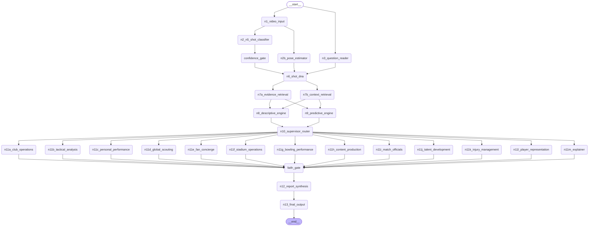

# The graph on Day 55

Drawn from the code by `backend/scripts/draw_graph.py`; dotted arrows are branches.

```mermaid
---
config:
  flowchart:
    curve: linear
---
graph TD;
	__start__([<p>__start__</p>]):::first
	n1_video_input(n1_video_input)
	n2_n5_shot_classifier(n2_n5_shot_classifier)
	confidence_gate(confidence_gate)
	n2b_pose_estimator(n2b_pose_estimator)
	n3_question_reader(n3_question_reader)
	n6_shot_dna(n6_shot_dna)
	n7a_evidence_retrieval(n7a_evidence_retrieval)
	n7b_context_retrieval(n7b_context_retrieval)
	n8_descriptive_engine(n8_descriptive_engine)
	n9_predictive_engine(n9_predictive_engine)
	n10_supervisor_router(n10_supervisor_router)
	n11a_club_operations(n11a_club_operations)
	n11b_tactical_analysis(n11b_tactical_analysis)
	n11c_personal_performance(n11c_personal_performance)
	n11d_global_scouting(n11d_global_scouting)
	n11e_fan_concierge(n11e_fan_concierge)
	n11f_stadium_operations(n11f_stadium_operations)
	n11g_bowling_performance(n11g_bowling_performance)
	n11h_content_production(n11h_content_production)
	n11i_match_officials(n11i_match_officials)
	n11j_talent_development(n11j_talent_development)
	n11k_injury_management(n11k_injury_management)
	n11l_player_representation(n11l_player_representation)
	n11m_explainer(n11m_explainer)
	faith_gate(faith_gate)
	n12_report_synthesis(n12_report_synthesis)
	n13_final_output(n13_final_output)
	__end__([<p>__end__</p>]):::last
	__start__ --> n1_video_input;
	__start__ --> n3_question_reader;
	confidence_gate --> n6_shot_dna;
	faith_gate --> n12_report_synthesis;
	n10_supervisor_router --> n11a_club_operations;
	n10_supervisor_router --> n11b_tactical_analysis;
	n10_supervisor_router --> n11c_personal_performance;
	n10_supervisor_router --> n11d_global_scouting;
	n10_supervisor_router --> n11e_fan_concierge;
	n10_supervisor_router --> n11f_stadium_operations;
	n10_supervisor_router --> n11g_bowling_performance;
	n10_supervisor_router --> n11h_content_production;
	n10_supervisor_router --> n11i_match_officials;
	n10_supervisor_router --> n11j_talent_development;
	n10_supervisor_router --> n11k_injury_management;
	n10_supervisor_router --> n11l_player_representation;
	n10_supervisor_router --> n11m_explainer;
	n11a_club_operations --> faith_gate;
	n11b_tactical_analysis --> faith_gate;
	n11c_personal_performance --> faith_gate;
	n11d_global_scouting --> faith_gate;
	n11e_fan_concierge --> faith_gate;
	n11f_stadium_operations --> faith_gate;
	n11g_bowling_performance --> faith_gate;
	n11h_content_production --> faith_gate;
	n11i_match_officials --> faith_gate;
	n11j_talent_development --> faith_gate;
	n11k_injury_management --> faith_gate;
	n11l_player_representation --> faith_gate;
	n11m_explainer --> faith_gate;
	n12_report_synthesis --> n13_final_output;
	n1_video_input --> n2_n5_shot_classifier;
	n1_video_input --> n2b_pose_estimator;
	n2_n5_shot_classifier --> confidence_gate;
	n2b_pose_estimator --> n6_shot_dna;
	n3_question_reader --> n6_shot_dna;
	n6_shot_dna --> n7a_evidence_retrieval;
	n6_shot_dna --> n7b_context_retrieval;
	n7a_evidence_retrieval --> n8_descriptive_engine;
	n7a_evidence_retrieval --> n9_predictive_engine;
	n7b_context_retrieval --> n8_descriptive_engine;
	n7b_context_retrieval --> n9_predictive_engine;
	n8_descriptive_engine --> n10_supervisor_router;
	n9_predictive_engine --> n10_supervisor_router;
	n13_final_output --> __end__;
	classDef default fill:#f2f0ff,line-height:1.2
	classDef first fill-opacity:0
	classDef last fill:#bfb6fc
```
